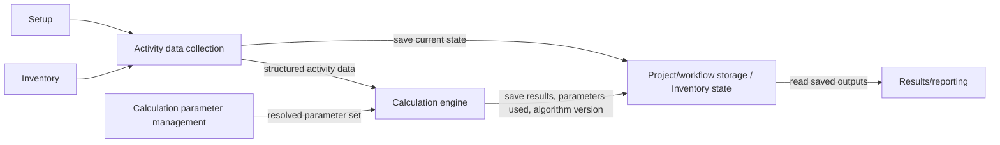

# Architecture Diagram

```mermaid
flowchart LR
    C["Setup"]
    I["Inventory"]

    ADC["Activity data collection"]
    FM["Calculation parameter management"]
    PWS["Project/workflow storage / Inventory state"]
    CE["Calculation engine"]
    RR["Results/reporting"]

    C --> ADC
    I --> ADC

    ADC -->|structured activity data| CE
    FM -->|resolved parameter set| CE

    ADC -->|save current state| PWS
    CE -->|save results, parameters used, algorithm version| PWS
    PWS -->|read saved outputs| RR
```
